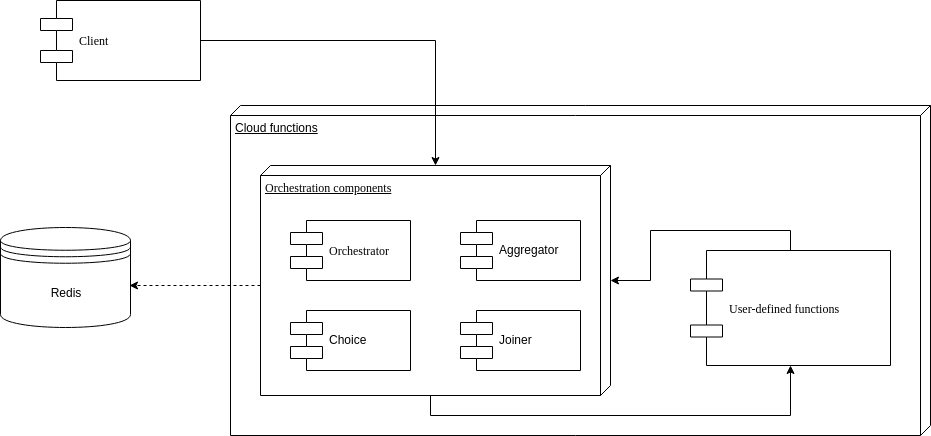
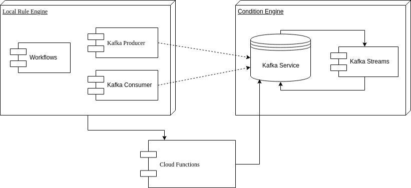

# Reactive Models for FaaS Orchestration

Cloud technologies and services are experiencing a strong growth, specially the Function as a Service (FaaS) and Serverless models. FaaS stands out for its nature based on events, where functions are triggered in response to events of the system (for example, when a file is uploaded to an object store). The FaaS and Serverless properties allow to create flexible and scalable applications, without provisioning resources in advance and with a pay per use model. However, to implement this type of applications, coordination (i.e. orchestration) mechanisms are needed in order to manage executions.

In this project we examine current orchestration systems and identify some of their limitations. After that, we work on these limitations and propose a coordination model that extends the event-based nature of FaaS. By doing so, events become key elements for coordination.

As a result, we present two prototypes. First, an orchestration system in which the orchestration logic is embedded in FaaS functions and that uses an external storage service to maintain information on the current state. Second, we propose a prototype with an intelligent and decoupled event system in charge of the orchestration, that transforms and generates events necessary for coordination and triggering of executions.

> This project has been developed as a contribution to the H2020 European project CloudButton, which is coordinated by the Cloud and Distributed Systems Lab of the Rovira i Virgili University. The aim of CloudButton is to democratize the access to big data by simplifying the overall life cycle and programming model thanks to serverless technologies. The use of serverless technologies for massive computations would make the infrastructure transparent to the users and ease the access to Big Data. More information on the project can be found in http://cloudbutton.eu/.

## Native Reactive Orchestration
Since FaaS enables event-driven computing, we propose a system that relies in events that trigger the execution of tasks. By doing so, we can eliminate blocking mechanisms that are prone to overload systems and induce overheads. Furthermore, events are a suitable alternative to create systems that orchestrate long-running tasks, liberating them from blocking techniques. Also, the event-driven nature of the orchestration allows for flexible compositions that vary in the length and type of tasks. 

Our protoype for function orchestration is implemented as serverless functions that contain the logic to process events and conditions and trigger the execution of tasks. In consequence, our orchestrator benefits from the inherent scalability of serverless functions and is portable between different Cloud platforms.

## Event Streaming Orchestration
In this prototype we focus on events management. Instead of using an external store to follow the workflow execution status and implement the orchestrator as FaaS functions, we manage events that signal occurrences with an event processing service. 

The management of events includes the reception and transformation in order to generate new events that trigger stages of the workflow. This handling is performed by a Condition Engine, that receives the events, groups them following *Conditions* and generates new events. The Condition Engine is implemented with an external event streaming service decoupled from the FaaS functions.

On the other hand, we also need a Rule Engine to manage the orchestration: it receives the generated events from the Condition Engine and triggers executions of actions. Our Rule Engine is developed to test the system but is not our goal to implement it following the Reactive Manifesto requirements. Our goal is to provide a model for function orchestration through events management.

